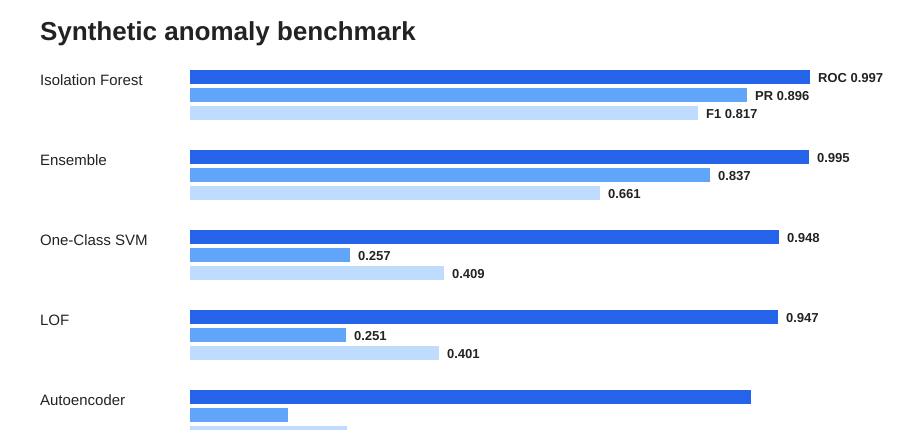
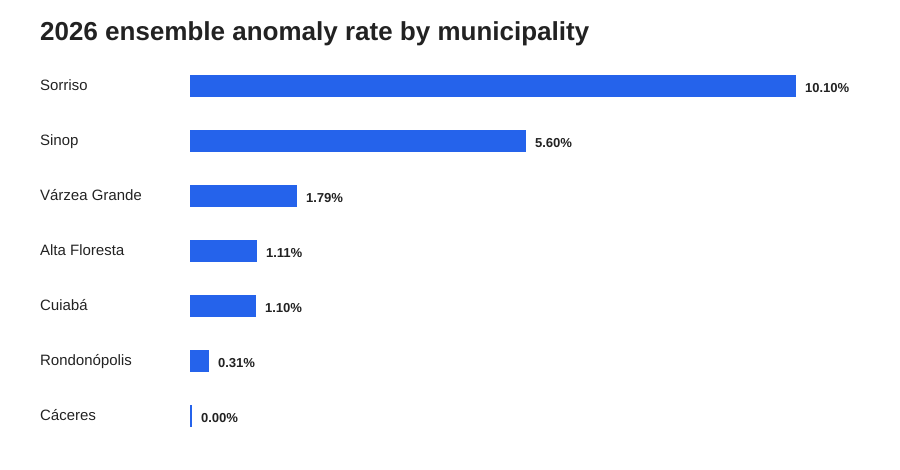
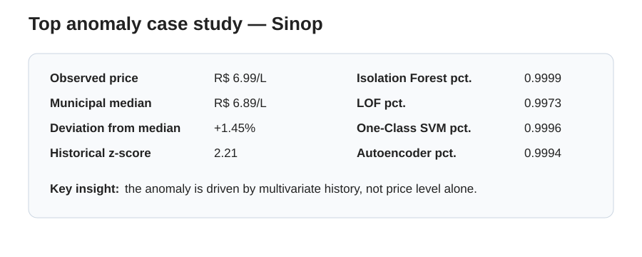

# Detecting Abnormal Fuel Pricing Behavior in Mato Grosso

Unsupervised machine learning project for detecting unusual weekly gasoline pricing behavior in **Mato Grosso, Brazil**, using public data from the **ANP**.

> An anomaly here means a statistically unusual observation. It is **not** evidence of fraud, price abuse, collusion or illegal behavior.

## Project idea

The main question is:

> **Can unsupervised machine learning detect unusual fuel pricing behavior when the local market and each station's own history are considered?**

Instead of treating a high price as automatically anomalous, each **gas station × week** observation is represented by price level, municipal context, temporal changes, rolling volatility and seasonality.

### Pipeline

```text
ANP data
   ↓
Mato Grosso + gasoline
   ↓
Gas station × week
   ↓
Temporal + local-market feature engineering
   ↓
RobustScaler
   ↓
Isolation Forest ─┐
LOF ──────────────┤
One-Class SVM ────┼──> percentile scores ───> Ensemble
Autoencoder ──────┘
   ↓
Synthetic-anomaly benchmark
   ↓
Interpretation + geographic analysis
```

## Dataset

| Stage | Observations |
|---|---:|
| Mato Grosso, all fuels | 36,184 |
| Gasoline records | 9,506 |
| ML-ready observations | 8,679 |
| Training set — 2024/2025 | 6,769 |
| Test set — 2026 H1 | 1,910 |

The 2026 test period contains **138 gas stations across 7 municipalities**.

The split is temporal:

```text
2024 ───────────── 2025 ─────────────│──────── 2026 H1
               TRAIN                 │          TEST
```

This makes the experiment closer to a monitoring system: the models learn from past data and score future observations.

## Features

The models use 15 variables.

**Local market context**

- current gasoline price;
- deviation from municipal median;
- municipal price percentile;
- deviation from the Mato Grosso median;
- number of surveyed stations in the municipality.

**Station history**

- 1-week price change;
- 4-week price change;
- deviation from the previous 4-week moving average;
- 4-week rolling volatility;
- 8-week rolling volatility;
- historical z-score.

**Seasonality**

- sine/cosine encoding for month;
- sine/cosine encoding for week of year.

## Models

Four unsupervised approaches were compared:

1. **Isolation Forest**
2. **Local Outlier Factor (LOF)**
3. **One-Class SVM**
4. **Autoencoder**

The four anomaly scores were then converted to empirical percentiles and averaged into an **ensemble score**.

## Controlled evaluation

Real ANP data does not contain an `anomaly = 0/1` label. To evaluate the detectors quantitatively, the notebook injected **66 controlled synthetic anomalies** into the 2026 test set through artificial upward and downward price shocks.

This benchmark is used only to compare model sensitivity. It does not imply that all untouched observations are truly normal.

## Results

| Model | ROC-AUC | PR-AUC | Precision | Recall | F1 |
|---|---:|---:|---:|---:|---:|
| **Isolation Forest** | **0.997** | **0.896** | **0.959** | 0.712 | **0.817** |
| Ensemble | 0.995 | 0.837 | 0.804 | 0.561 | 0.661 |
| One-Class SVM | 0.948 | 0.257 | 0.257 | **1.000** | 0.409 |
| LOF | 0.947 | 0.251 | 0.252 | 0.985 | 0.401 |
| Autoencoder | 0.904 | 0.158 | 0.163 | 0.561 | 0.253 |



The **Isolation Forest was the strongest individual model**, combining very high ranking performance with a substantially better Precision-Recall profile.

LOF and One-Class SVM were highly sensitive, but their precision was close to 25%, meaning they generated many more false positives in the synthetic benchmark.

The Autoencoder learned the historical feature structure, but reconstruction error was less discriminative than the Isolation Forest score.

## Ensemble results in 2026

The final ensemble threshold was approximately **0.9867**.

- observations scored: **1,910**;
- observations flagged: **39**;
- anomaly rate: **2.04%**.

## Geographic patterns

| Municipality | Anomaly rate | Maximum score | Observations |
|---|---:|---:|---:|
| **Sorriso** | **10.10%** | 0.996 | 99 |
| **Sinop** | **5.60%** | 0.999 | 250 |
| Várzea Grande | 1.79% | 0.995 | 392 |
| Alta Floresta | 1.11% | 0.992 | 180 |
| Cuiabá | 1.10% | 0.997 | 456 |
| Rondonópolis | 0.31% | 0.995 | 327 |
| Cáceres | 0.00% | 0.982 | 206 |



These values should **not** be interpreted as rankings of misconduct or market quality. The survey coverage differs across municipalities and only seven municipalities appear in this gasoline sample.

## Case study — Sinop

The observation with the highest ensemble score in 2026 was approximately **0.999**.



The selected observation had:

- price: **R$ 6.99/L**;
- municipal median: **R$ 6.89/L**;
- deviation from the municipal median: only **+1.45%**;
- historical z-score: **2.21**;
- Isolation Forest percentile: **0.9999**;
- LOF percentile: **0.9973**;
- One-Class SVM percentile: **0.9996**;
- Autoencoder percentile: **0.9994**.

This is one of the most important findings of the project: **an observation can be unusual without being the highest price in the market**.

The detector is reacting to the combination of current price, recent trajectory and volatility. Earlier in 2026 the same station registered **R$ 7.09/L** after an approximately **18.36% weekly increase**, accompanied by an extreme historical z-score.

## Interpretation

SHAP analysis of the Isolation Forest score indicated that the strongest contributors included:

1. current price;
2. one-week price variation;
3. deviation from the recent moving average;
4. short-term rolling volatility;
5. historical z-score;
6. longer-term volatility;
7. number of surveyed competitors;
8. municipal price deviation.

SHAP is used to explain the model score, **not as a causal estimate of fuel-price formation**.

## Main conclusions

- Isolation Forest performed best in the controlled benchmark.
- The ensemble retained excellent ranking ability but was more conservative at the selected threshold.
- LOF and One-Class SVM achieved very high recall but produced substantially more false positives.
- The Autoencoder converged successfully, but reconstruction error was less discriminative.
- Sorriso and Sinop showed the largest concentration of ensemble flags in the available 2026 sample.
- Strong anomalies were often related to historical trajectory and volatility rather than price level alone.

## Limitations

1. Only seven Mato Grosso municipalities are represented in the gasoline sample used here.
2. There are no confirmed real-world anomaly labels.
3. The 2% threshold is an operational modeling choice.
4. The analysis is not causal.
5. Exchange rate, crude oil, refinery prices, taxes, freight and logistics are not included.
6. Station-level flags must not be interpreted as accusations or evidence of illegality.

## Run the notebook

The complete executed project was developed in Google Colab:

**[Open the Colab notebook](https://colab.research.google.com/drive/1wwyYLsDAFcVe4-FeLpnp-c2E_83EFGtj?usp=sharing)**

The notebook downloads the ANP data, performs preprocessing and feature engineering, trains all four detectors, builds the ensemble, injects synthetic anomalies, evaluates the models and generates the geographic analysis.

## Detailed analysis

A Portuguese technical discussion of the results is available in:

**[REPORT.md](REPORT.md)**

## Repository structure

```text
mt_fuel_anomaly/
├── README.md
├── REPORT.md
├── requirements.txt
└── assets/
    ├── model_comparison.svg
    ├── municipality_anomaly_rates.svg
    └── case_study.svg
```

## Tech stack

- Python
- pandas
- NumPy
- scikit-learn
- TensorFlow / Keras
- GeoPandas
- Matplotlib
- SHAP
- ANP public fuel-price data
- IBGE municipal boundaries

## Next steps

- include ethanol and diesel;
- add oil, refinery and exchange-rate variables;
- train municipality-specific models;
- optimize ensemble weights;
- use rolling temporal retraining;
- deploy a Streamlit monitoring dashboard;
- automate weekly ANP updates.

---

### Main takeaway

> **A price can be unusual without being the highest price in the market.**

By combining local benchmarks with each station's own temporal behavior, unsupervised machine learning can detect patterns that simple fixed thresholds would miss.
